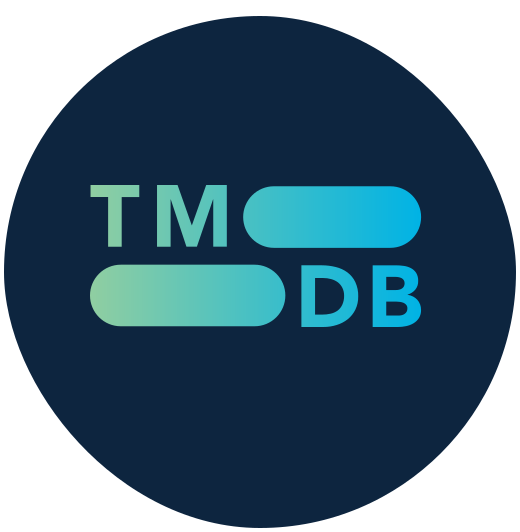
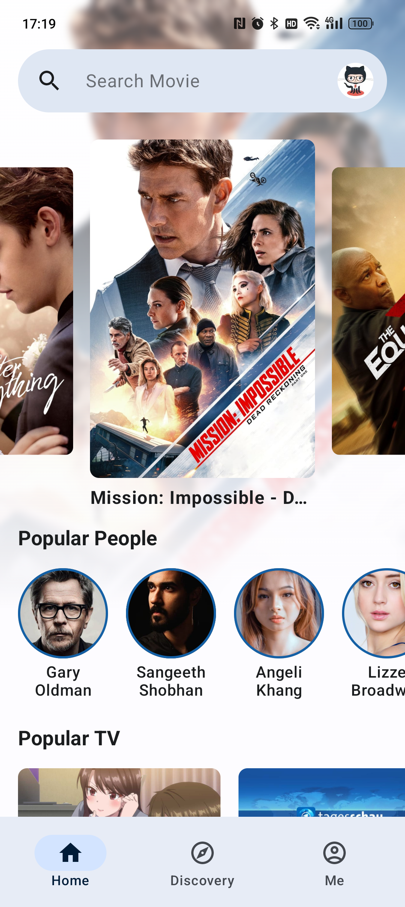
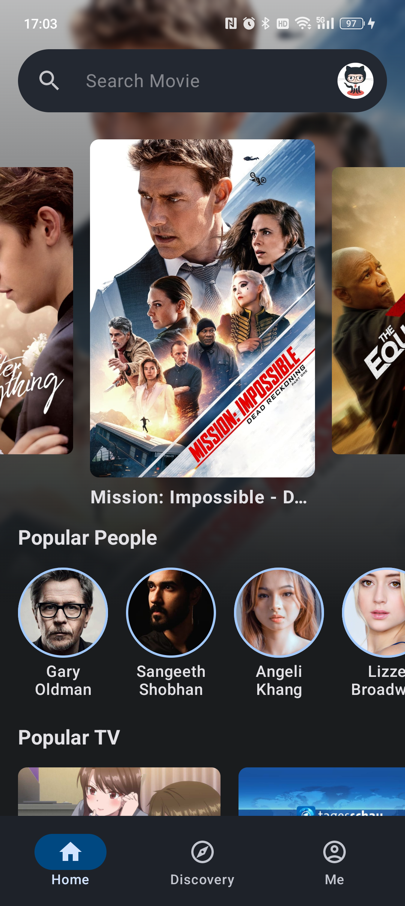
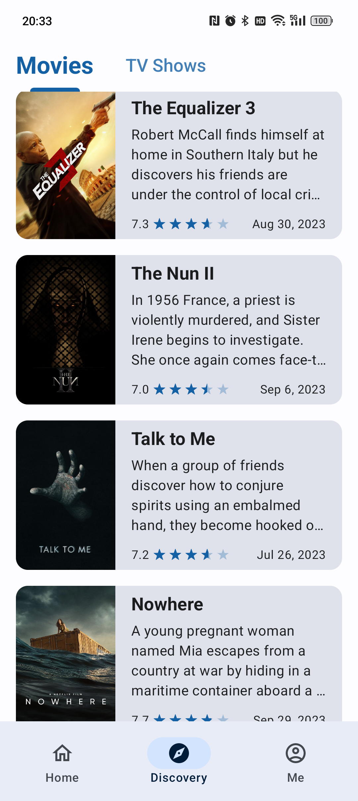
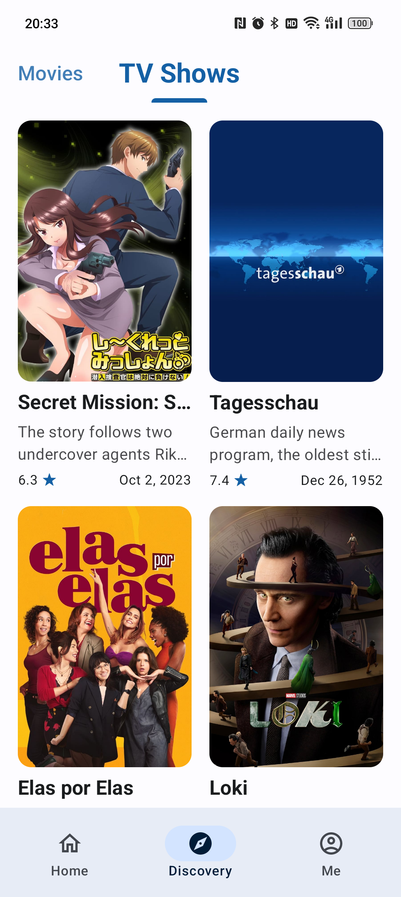
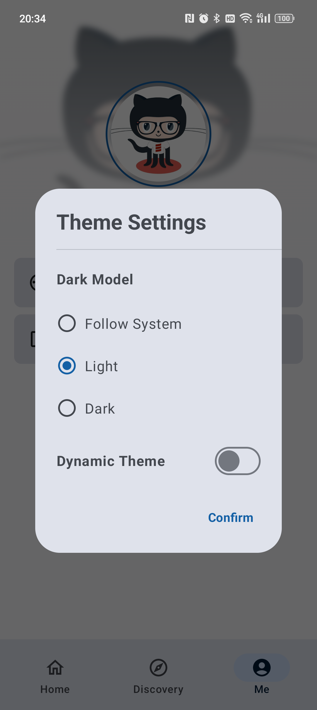
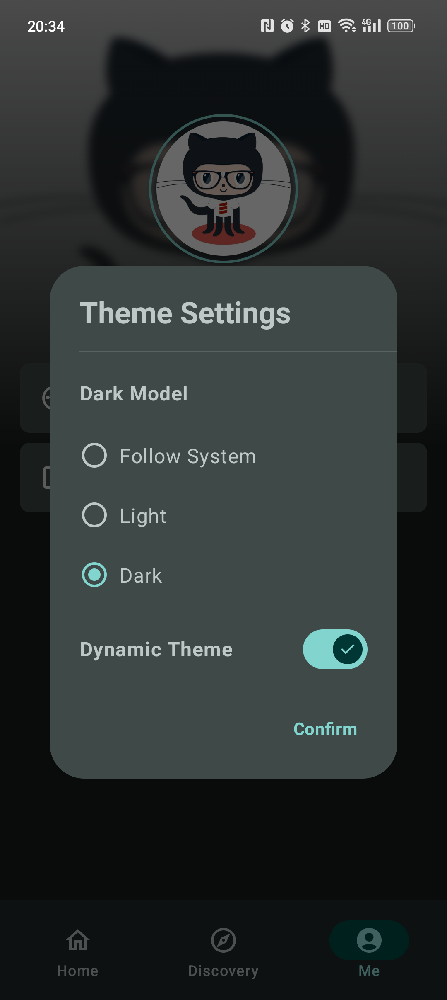
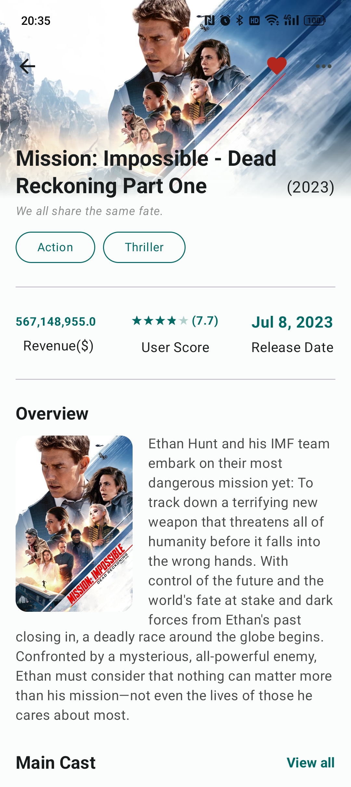
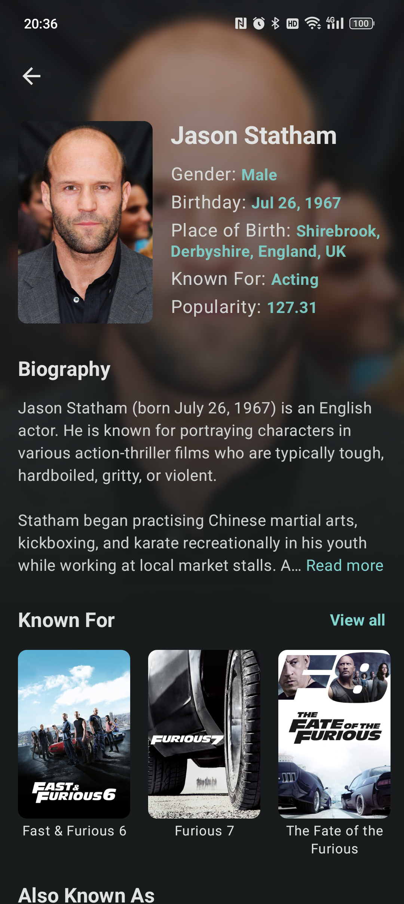
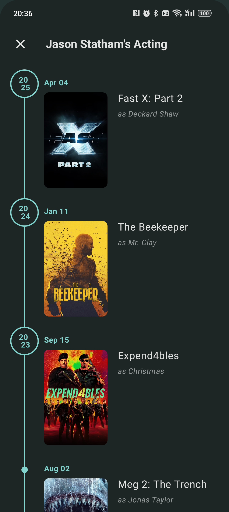

<p align="center">
    
</p>

</br>
</br>

<p align="center">
  <strong>
    一款基于<a href="https://developer.themoviedb.org/docs">TMDB API</a>开发的电影、电视剧查询Android APP
  </strong>
</p>

<p align="center">
  
  <a href="LICENSE">
    
  </a>
  
</p>

<p align="center">
    <a href="https://github.com/sqsong66/TMDB-Movie">TMDB电影</a>是我个人用来学习<a href="https://developer.android.com/jetpack/compose">Jetpack Compose</a>的一个Demo项目，项目代码采用Kotlin Jetpack Compose编写。项目接口采用的是 <a href="https://developer.themoviedb.org/docs">TMDB API</a>，感谢<a href="https://www.themoviedb.org/">TMDB</a>(The Movie Database) 提供的API接口。
</p>

<div align="center">
<table>
  <tr>
    <td> 
      <p align="center">
       <br>
      <em>Home Page(Light Mode)</em>
      </p>
    </td>
    <td> 
      <p align="center">
       <br>
      <em>Home Page(Dark Mode)</em>
      </p>
    </td>
  </tr>
</table>
</div>

项目整体采用Jetpack Compose编写，跟传统的XML编写有较大的差异。该项目是个人学习Jetpack Compose的练手项目，架构参考了Google开源项目[nowinandroid](https://github.com/android/nowinandroid)。     
APP的设计风格遵循[Material Design3](https://m3.material.io/)规范, Material Design3各种控件都很精美。APP支持浅色、深色以及动态主题。


## 编译运行
1. 首先需要到[TMDB官网](https://www.themoviedb.org/settings/api)注册账号，并申请获取Access Token。
2. 在项目根目录创建 `local.properties`文件(如果没有的话), 并将申请的Access Token填入其中。
   ```
   TMDB_ACCESS_TOKEN = YOU_TMDB_ACCESS_TOKEN
   ```
3. 项目中配置了Release Keystore，用于生成发布APK，如果不需要的话，可以删除app`build.gradle.kts`中的`signingConfigs`配置。
4. 运行编译apk。

## Spported Features
- [x] 流行的电影、电视剧、人物。
- [x] 电影、电视剧趋势。
- [x] 正在上映的电影、电视剧。
- [x] 发现电影、电视剧。
- [x] TMDB授权登录。
- [x] 电影、电视剧、人物详情。
- [x] 添加电影、电视剧到喜欢。
- [x] 添加电影、电视剧到观看列表。
- [x] 创建列表
- [x] 添加电影、电视剧到列表。
- [x] 分享电影、电视剧、人物。
- [x] 更换主题。
- [x] 电影、电视剧、人物搜索。
- [ ] 电影、电视家评分。
- [ ] 我的列表及列表详情。
- [ ] 我的观影列表
- [ ] 我喜欢的电影、电视剧。
- [ ] 我的电影、电视家评分。
- [ ] ...

## APP截图
<div align="left">
<table>
  <tr>
    <td> 
      <p align="center">
       <br>
      <em>Discovery Movies(Light Mode)</em>
      </p>
    </td>
    <td> 
      <p align="center">
       <br>
      <em>Discovery TVs(Light Mode)</em>
      </p>
    </td>
  </tr>

  <tr>
    <td> 
      <p align="center">
       <br>
      <em>Theme Setting(Light Mode)</em>
      </p>
    </td>
    <td> 
      <p align="center">
       <br>
      <em>Theme Setting(Dark Mode)</em>
      </p>
    </td>
  </tr>

  <tr>
    <td> 
      <p align="center">
       <br>
      <em>Movie Details(Light Mode)</em>
      </p>
    </td>
    <td> 
      <p align="center">
       <br>
      <em>Movie Details(Light Mode)</em>
      </p>
    </td>
  </tr>

  <tr>
    <td> 
      <p align="center">
       <br>
      <em>People Details(Dark Mode)</em>
      </p>
    </td>
    <td> 
      <p align="center">
       <br>
      <em>Actor's Acting(Dark Mode)</em>
      </p>
    </td>
  </tr>
</table>
</div>

## Demo视频
https://github.com/sqsong66/TMDB-Movie/assets/11425148/5e9cb590-6042-4444-a47f-9bfe6df9d67c

## 感谢 
[TMDB(The Movie Database)](https://www.themoviedb.org/)  
[nowinandroid](https://github.com/android/nowinandroid)  
[Jetpack Compose](https://developer.android.com/jetpack/compose)

## LICENSE
见[LICENSE](LICENSE)


